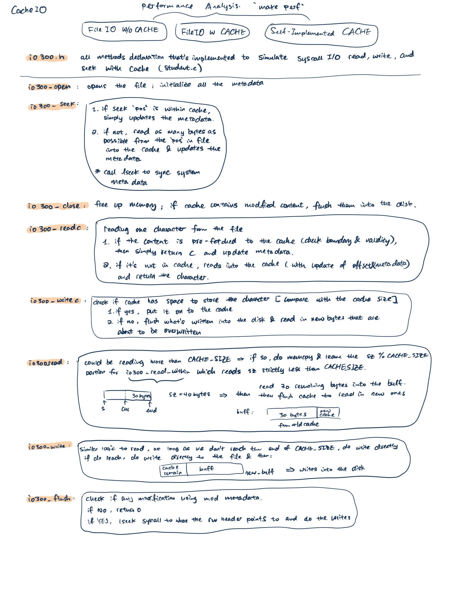
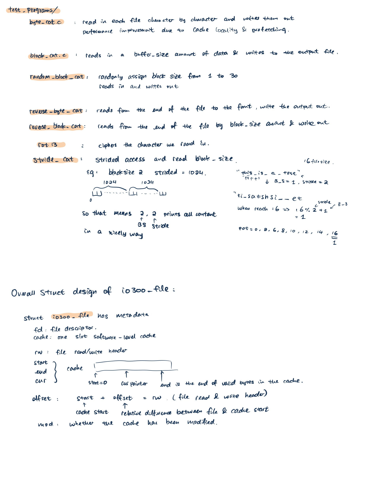

# Project 3: Caching I/O

## Design Overview:

The Cache I/O Performance Improvement

In addition to the stencil given in this project, I have also added a few metadata for keeping the cache and the file IO pointers in synchronization. In the `student.c` implementation, it contains:

- file descriptor, cache which stores `CACHE_SIZE` amount of caching data, read/write header of the file which points to our current reading point in the file;
- start, end and cur of the valid cache: this is used so that our program could know when to flush the entire cache
- the relative offset in cache (start offset) in regards to the rw header in the file: this records the relative difference between the cache f->start and the f->rw in the file.
- modification flag: this is used to define whether or not we need to call `lseek` and `write` system calls in `io300_flush`. This mod flag improves my implementation's performance.
  To optimize the performance of our implemetation, I have added eliminated all calls to `io300_filesize`; used memcpy into buffer for read/write instead of using loops; made sure that we are only writing to the file when cache contents have changed; exclude the usage of `readc` and `writec` in the `read` and `write` functions; eliminate the number of `lseek` syscalls.

## `io300_readc` && `io300_writec`

For readc and writec, we correspondingly read or write in the cache with updating the metadata in our program.

## `io300_read`

For `io300_read`, we used a helper function `io300_read_within` which reads a size that is less than the `CACHE_SIZE` we defined. The `io300_read` has performance optimization such that if the size we are reading is actually bigger than the CACHE_SIZE, then we first automatically read `sz - sz % CACHE_SIZE` and then call `io300_read_within` with the remaining size which is guaranteed to be smaller than the CACHE_SIZE (since we used % function). This will eliminate many read calls (my previous implementation uses a while loop to continuously call the `io300_read_within` with CACHE_SIZE which is time consuming).

## `io300_write`

For `io300_write`, we also have performance optimizations such that we are determining whether the size to write is actually larger than what is available in the cache (`CACHE_SIZE - f->end`). If the remaining CACHE_SIZE is too small to fit all of the bytes we want to write, we directly use `memcpy` to write the argument in `buff` to our file. Of course, we need to first add the remaining valid bytes of the cache into the buff as well. Hence, for this scenario, I created a `new_buffer` which has a size of (`rem [remaining bytes in cache] + needed`) and then write the new amount of bytes into the file. This will also eliminate many write calls (my previous implementation uses a for loop to continuously call the `io300_writec` with which is time consuming). My previously implementation with for-loop calling `io300_writec` will call this function by `sz` times each time `io300_write` is being called which is super inefficient.

## `io300_seek`

For io300_seek, we are updating the metadata pointers correspondingly and finally call `lseek` to adjust the system metadata pointers.

## `io300_flush`

For `io300_flush`, we first determined whether or not our file has been modified using the `mod` flag. If the file is NOT modified (such as simply doing read), then we return 0 and exit the function. This is to save the number of syscalls we do in `io300_flush`. Otherwise, if the cache has been changed (modified with write, writec), then we need to first lseek to the correct location using the file rw header `f->rw` and then do write with the amount of `CACHE_SIZE`.

1. [Original] Commit 657774b
   Mainly in this design, I was doing the read with a while loop that first reads all divisible amount of CACHE_SIZE bytes and then at the end read through the last (< CACHE_SIZE) bytes. For `write`, I implemented a for-loop that writes each characters.

- On local computer:
  ```
  ======= PERFORMANCE RESULTS =======
  byte_cat: 1.88x stdio's runtime
  reverse_byte_cat: 2.92x stdio's runtime
  block_cat: 1.67x stdio's runtime
  reverse_block_cat: 1.77x stdio's runtime
  random_block_cat: 1.68x stdio's runtime
  stride_cat: 1.26x stdio's runtime
  ```
- On grading server:
  ```
  ======= PERFORMANCE RESULTS =======
  byte_cat: 6.85x stdio's runtime
  reverse_byte_cat: 2.96x stdio's runtime
  block_cat: 24.5x stdio's runtime
  reverse_block_cat: 4.33x stdio's runtime
  random_block_cat: 14.5x stdio's runtime
  stride_cat: 1.26x stdio's runtime
  ```

2. moved the lseek valid check syscall after checking whether the `pos` given is within boundary. This way, we won't have to call `lseek` when seeking position that is already within the cache

- On local computer:
  ```
  ======= PERFORMANCE RESULTS =======
  byte_cat: 1.87x stdio's runtime
  reverse_byte_cat: 2.96x stdio's runtime
  block_cat: 1.67x stdio's runtime
  reverse_block_cat: 1.81x stdio's runtime
  random_block_cat: 1.66x stdio's runtime
  stride_cat: 0.82x stdio's runtime
  ```
- On grading server:
  ```
  ======= PERFORMANCE RESULTS =======
  byte_cat: 6.38x stdio's runtime
  reverse_byte_cat: 2.93x stdio's runtime
  block_cat: 24.0x stdio's runtime
  reverse_block_cat: 4.25x stdio's runtime
  random_block_cat: 14.5x stdio's runtime
  stride_cat: 0.79x stdio's runtime
  ```

3. For single byte reads, used pointer assignments (stored in metadata for each file), rather than the `memcpy` system call to improve performance

- On local computer:
  ```
  performance result: byte_cat: stdio=0.67s, student=1.28s, ratio=1.91
  performance result: reverse_byte_cat: stdio=3.80s, student=11.10s, ratio=2.92
  performance result: block_cat: stdio=0.62s, student=1.00s, ratio=1.61
  performance result: reverse_block_cat: stdio=0.76s, student=1.34s, ratio=1.76
  performance result: random_block_cat: stdio=0.62s, student=1.03s, ratio=1.66
  performance result: stride_cat: stdio=5.57s, student=5.04s, ratio=0.90
  ======= PERFORMANCE RESULTS =======
  byte_cat: 1.91x stdio's runtime
  reverse_byte_cat: 2.92x stdio's runtime
  block_cat: 1.61x stdio's runtime
  reverse_block_cat: 1.76x stdio's runtime
  random_block_cat: 1.66x stdio's runtime
  stride_cat: 0.9x stdio's runtime
  ```
- On grading server:
  ```
  ======= PERFORMANCE RESULTS =======
  byte_cat: 6.62x stdio's runtime
  reverse_byte_cat: 3.02x stdio's runtime
  block_cat: 24.5x stdio's runtime
  reverse_block_cat: 4.52x stdio's runtime
  random_block_cat: 14.5x stdio's runtime
  stride_cat: 0.8x stdio's runtime
  ```

4. For write function, instead of memcpy and writec, I determined if the `cache_size - f->end`, which is the remaining room of bytes to write in the CACHE, is enough for our `sz` write. If it is, then we simply do the memcpy and correspondingly updates the metadata. If it is not, then we directly writes into the file with the sz amount of bytes (minus leftover bytes from the cache [`f->end - f->cur`]). That way, we could save the number of function calls that are constrained by the cache size.

- On Local Computer:
  ```
  ======= PERFORMANCE RESULTS =======
  byte_cat: 1.88x stdio's runtime
  reverse_byte_cat: 2.76x stdio's runtime
  block_cat: 1.05x stdio's runtime
  reverse_block_cat: 1.32x stdio's runtime
  random_block_cat: 1.08x stdio's runtime
  stride_cat: 0.8x stdio's runtime
  ```
- On grading server:
  ```
  -> ./stride_cat 1 1024 /tmp/infile /tmp/outfile
  performance result: byte_cat: stdio=0.13s, student=0.83s, ratio=6.38
  performance result: reverse_byte_cat: stdio=5.14s, student=14.80s, ratio=2.88
  performance result: block_cat: stdio=0.02s, student=0.06s, ratio=3.00
  performance result: reverse_block_cat: stdio=0.23s, student=0.55s, ratio=2.39
  performance result: random_block_cat: stdio=0.05s, student=0.12s, ratio=2.40
  performance result: stride_cat: stdio=7.61s, student=5.77s, ratio=0.76
  ======= PERFORMANCE RESULTS =======
  byte_cat: 6.38x stdio's runtime
  reverse_byte_cat: 2.88x stdio's runtime
  block_cat: 3.0x stdio's runtime
  reverse_block_cat: 2.39x stdio's runtime
  random_block_cat: 2.4x stdio's runtime
  stride_cat: 0.76x stdio's runtime
  ```

## Project Structure



